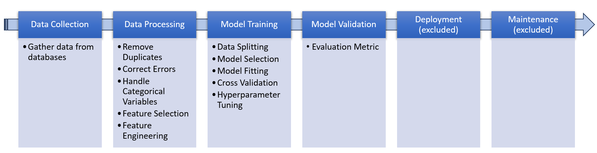

# Project-01

This machine learning pipeline aims to showcase what I have learnt over the past few months. 
The EDA is conducted in an interactive notebook(eda.ipynb) in Python.
An executable bash script(run.sh) will run the training models and log(main.log) the results

## 1. Folder Structure
```markdown
Project/
|
├── config
│   └── config.yaml
├── data
│   └── raw
│       ├── air_quality.db
│       └── weather.db
├── eda.ipynb
├── env
│   ├── requirements.txt
│   └── setup.sh
├── LICENSE
├── main.log #Created only after executing run.sh
├── README.md
├── run.sh
└── src
    ├── helper
    │   ├── data_processing.py
    │   └── model_training.py
    ├── main.py
    └── utils.py

```


## 2. How to use:
System used: Ubuntu 22.04 
Python used: 3.10.12

1. Navigate to the unzipped folder from the command line or terminal.
2. Execute: `source setup.sh` This will help to create a virtual environment named 'venv' and also install the dependencies in 'requirements.txt'.
3. Open Jupyter Notebook and select `eda.ipynb`.
4. Execute: `source run.sh`  

**Note:** The datasets has been intentionally included in the data folder for the convenience of first-timers.


## 3. Machine Learning Pipeline.





## 4. Models used

The goal is to predict solar panel efficiency (Low, Medium, or High) based on forecasted weather data, making this a multiclass supervised learning problem. 

Initially, we will use **Logistic Regression** as our baseline model. Its simplicity and ease of setup make it a good choice for establishing a benchmark. Additionally, logistic regression offers straightforward interpretability of results, which helps in understanding the model's behavior and performance.

Next, we will implement **XGBoost** an ensemble method that combines multiple weak learners(decision trees in this case) to create a strong learner. Although XGBoost will require longer training times, it excels in capturing complex relationships within the data. We will also employ **GridSearchCV** to perform some hyperparameter tuning to further improve accuracy.

Finally, we will employ **AutoGluon**, an automated machine learning framework designed to streamline model selection and hyperparameter tuning. AutoGluon automates the creation of ensembles by training multiple models and combining their predictions, thus leveraging the strengths of various algorithms to produce a more accurate and reliable model. The downside is that it requires a powerful GPU and long training time to deliver the best results.


## 5. Results

1. **Logistic Regression:**
   - Train accuracy score: 74.8%
   - CV accuracy score: 73.6%
   - Test accuracy score: 77.1%


2. **XGBoost:**
   - Train accuracy score: 84.5%
   - CV accuracy score: 84.3%
   - Test accuracy score: 87%


3. **AutoGluon:**
   - Train accuracy score: 84.9%
   - CV accuracy score: 84.2%
   - Test accuracy score: 87.2%

   
Logistic Regression ran in just 1 second, establishing a benchmark for model performance. However, its results indicate that it struggles to capture the complexity of the data. XGBoost demonstrated a significant improvement over Logistic Regression. Its advanced capabilities to model complex patterns and interactions yielded substantially higher accuracy. 

AutoGluon achieved the highest performance with a test accuracy score of 87.2%. The train accuracy and CV accuracy values are close, indicating there is no overfitting or underfitting. Test accuracy is also close to CV accuracy, indicating the model generalizes well to new data. AutoGluon’s strengths in automated hyperparameter tuning and ensemble learning made it the most reliable model(out of these 3) for predicting solar panel efficiency.


